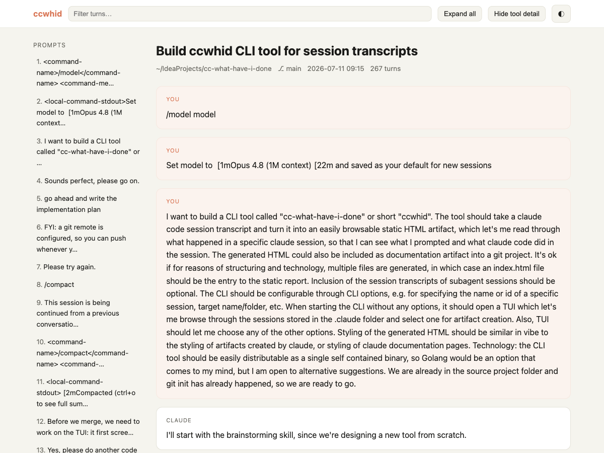
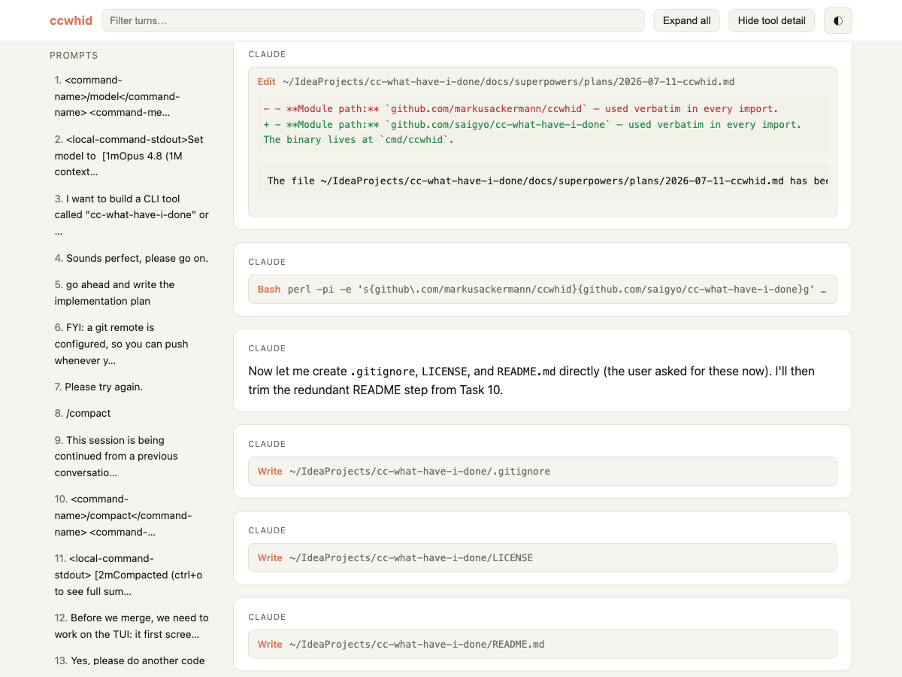
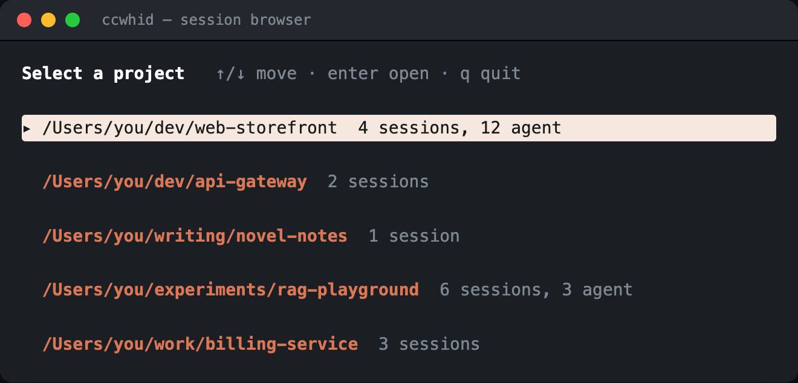
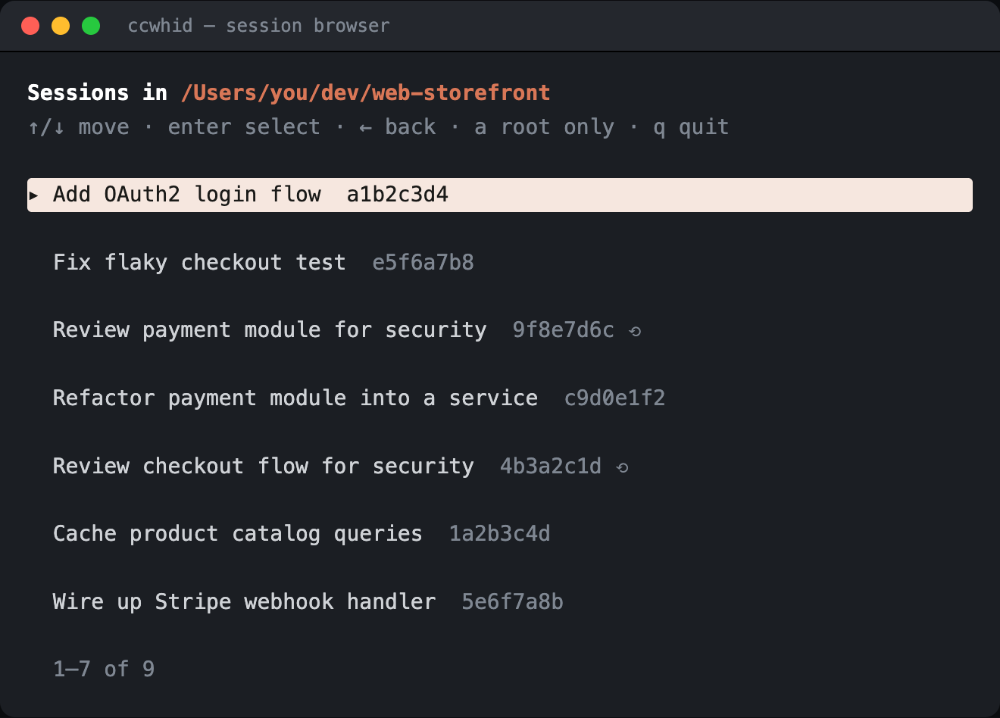

# ccwhid — cc-what-have-i-done

Turn a Claude Code session transcript into a browsable, self-contained static
HTML report. See what you prompted and what Claude Code did — and commit the
report into your repo as a documentation artifact.

> **Status:** under active development. See
> [`docs/superpowers/plans/`](docs/superpowers/plans/) for the implementation plan.

## Preview

A full example — ccwhid rendering the very session that built it — is committed
at [`docs/session-report/index.html`](docs/session-report/index.html); clone the
repo and open it in a browser.

| Report overview | Tool calls & diffs |
|:---:|:---:|
| [](docs/session-report/index.html) | [](docs/session-report/index.html) |

The report is one self-contained page: a jump-to-prompt sidebar, a live turn
filter, expand/collapse-all, and a light/dark toggle — all client-side, no
server.

## Install

```bash
go install github.com/saigyo/cc-what-have-i-done/cmd/ccwhid@latest
```

Or build locally:

```bash
go build -o ccwhid ./cmd/ccwhid
```

## Usage

```bash
ccwhid                      # browse sessions in an interactive TUI
ccwhid --latest             # render the most recent session
ccwhid --session <id>       # render a specific session (id or prefix)
ccwhid --session <id> --open
```

The report is written to `./ccwhid-report/<session-short>/` by default (override
with `--out`). Open `index.html` in any browser — no server needed.

### Browsing sessions

Run `ccwhid` with no selector to open the interactive browser:

- **Project list** — every project with sessions, most-recent first. `↑`/`↓`
  to move, `enter` (or `→`) to open a project, `q` to quit.
- **Session list** — the chosen project's sessions. `enter` selects, `←` (or
  `esc`) returns to the project list.
- Both lists **scroll** to fit any terminal size.
- By default only your **interactive sessions** are shown. Claude Code writes
  each Task subagent / code-review agent as its own transcript; press **`a`**
  in the session list to show (and hide) those agent sessions — they're marked
  with a `⟲`.
- Selecting a session opens an **options screen** to toggle subagents,
  redaction, and open-in-browser, and to type an output directory (blank uses
  the default) before generating.

`--project <name>` opens the browser directly on that project's session list.



*Pick a project, then a session. Agent transcripts are hidden until you press
`a`, then marked with `⟲`:*



### Flags

| Flag | Description |
|------|-------------|
| `--session <id>` | Session id or unambiguous prefix to render |
| `--project <path\|name>` | Scope `--latest` to a project, or open the TUI on it (matches full path, basename, or unambiguous substring) |
| `--latest` | Render the most recent interactive session (skips agent transcripts) |
| `--out <dir>` | Output directory |
| `--title <str>` | Override the report title |
| `--include-subagents` | Include subagent (Task) activity (default true; `--include-subagents=false` to omit) |
| `--no-redact` | Disable secret redaction |
| `--force` | Overwrite a non-empty output directory |
| `--open` | Open the report in a browser when done |

## Redaction

By default, ccwhid scrubs common secret shapes (AWS keys, API tokens, JWTs,
`KEY=`/`TOKEN=`/`SECRET=` assignments) and rewrites your home directory to `~`.
This is best-effort defense-in-depth — **review generated reports before
committing them.** Disable with `--no-redact`.

## What's included

Your prompts, Claude's replies (rendered markdown + syntax-highlighted code),
tool calls with collapsible detail, `Edit`/`Write` diffs, collapsed thinking
blocks, and — optionally — nested subagent activity. System reminders and
attachments are omitted for readability.

## License

[MIT](LICENSE) © 2026 Markus Ackermann
